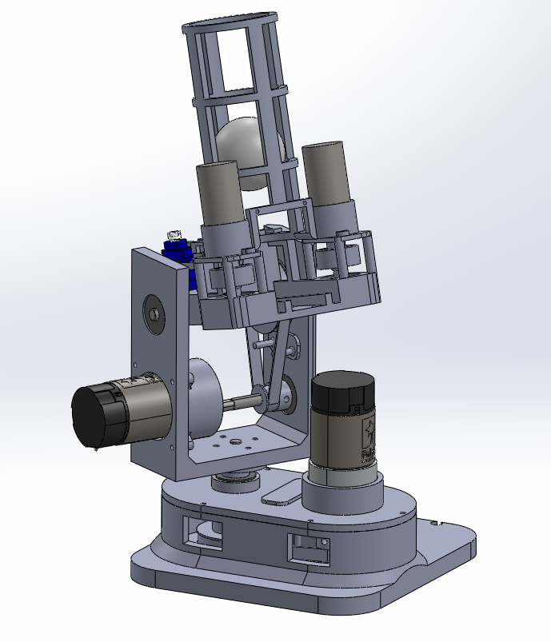
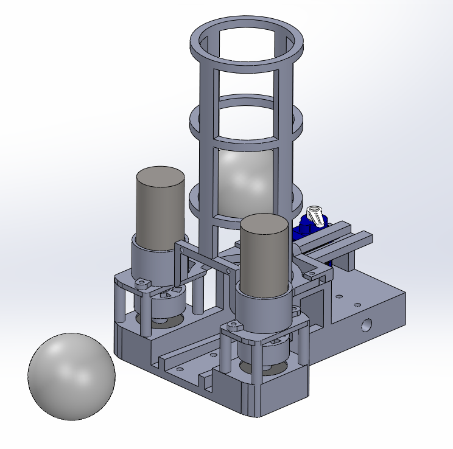
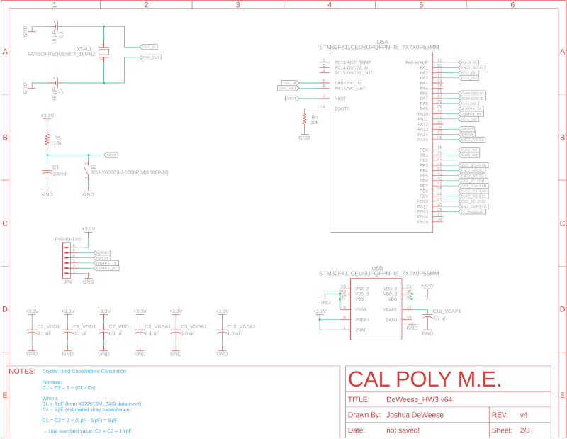
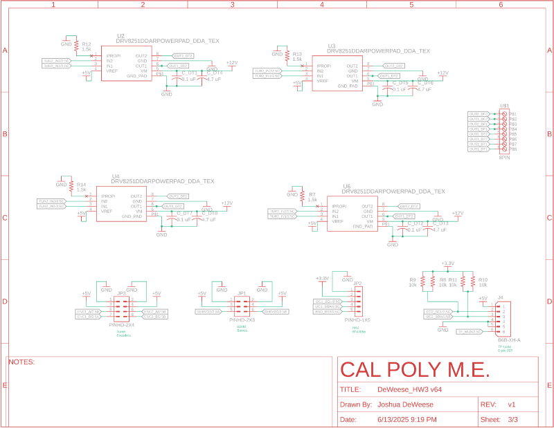

# ME 507 - Ping Pong Ball Launcher

**Team Members:** Josh DeWeese, Nolan Jeung  
**Support:** Charlie Refvem, Vincent Ngo, Jason Wong

---

**Link to repository:** https://github.com/joshdewy123/ME507_PONG

**Link to video:** https://youtube.com/shorts/3GikZNkVesM?feature=share

---

## Overview

This autonomous ping pong launcher is capable of both manual and automatic targeting and launching. It rotates about two axes to aim, detects objects using a TF-Luna LIDAR, and fires ping pong balls using dual flywheels. The system is built around a custom PCB featuring an STM32 microcontroller, motor drivers, and dedicated I2C lines.

The goal of this project was to create a functional and robust autonomous targeting system while designing and assembling most of the electronics and mechanical components from scratch.

---

## Hardware (Mechanical)

The robot was designed to use primarily hardware already in our possession in order to be cost-efficient, since the robot was not anticipated to pull extremely heavy loads anyways. The list of actuators and their purposes are below:

- **2x Pololu 50:1 Gearmotor (4753):** – 12V DC motor with built-in encoders to control the turret/aiming of the robot. Their reasonable size and torque made them a viable choice for this project.
- **2x Maxon DCX 22 mm OD Motors:** - 18V DC motor with no external gearbox or sensors. They are able to reach up to about 5000 RPM at nominal speeds, making them a great choice for our flywheels. Despite their nominal voltage of 18V, they were run using 12V instead to limit the necessary power redistribution of our electronics.
- **1x MG90 Servo Motor:** - simple 5V servo motor used to control ball loading and launching. Moves to certain angles dependent on the signal sent to it. They were used to push balls forward into the launcher while blocking the next ball from launching at the same time, providing the robot functionality to control when and the quantity of balls launched.

The rest of the robot was constructed using a combination of 3-D printed and off-the-shelf components. The robot implements a modular design to allow for easy re-design, removal, and reattachment of components when necessary. Power transfer between the launcher and motors was achieved using belts, pulleys, hand-cut shafts, and bearings. All fasteners are a combination of M2, M2.5, or M3 screws when necessary, and heat-set inserts were used in many locations for ease of assembly and a high overall quality of work.

Small attachment parts were made during the project’s development, and they proved to be very important. First, the flywheels were simply 3-D printed to attach to the Maxon DCX motor’s shaft, as well as be supported by bearings below. Launcher compression was achieved using super-glued foam strips around the wheels. Secondly, the different tensioners were created to improve the grip of the belt-pulley systems. On initial testing, the motors did not have enough tension with the components they were meant to move. Tensioners were added and vastly improved the power transfer of the robot.

Overall, the mechanical design of the robot worked very well. The magazine, launcher, and ball loading mechanism worked especially well. Power transfer between the motors and other components worked well, but over time, the plastic 3-D printed components began losing their grip on the metal shafts, causing more slip over time. If the project were continued with moree time and budget, the robot would utilize more metal mechanical components for longevity.





---

## Hardware (Electrical)

### Fusion 360 Schematics






### Fusion 360 CAD Render


### Assembled PCB - Before Hotfixes


### Assembled PCB - After Hotfixes


**This board includes:**

- STM32F411CEU6 microcontroller
- DRV8251 motor drivers
- Barrel jack for 12V input
- 5V and 3.3V rails (via Buck and LDO regulators)
- I2C, UART, and GPIO breakout headers

---

## Roadblocks and Debugging Challenges

### 1. **Motor Driver Output Failures**

**Issue:** Turret motor driver (DRV8251) failed to drive motors consistently.

**Cause:** Missing or insufficient bulk capacitance and improper IPROPI pin handling.  
**Fix:**

- Added 0.1 µF and 4.7 µF capacitors to stabilize power rails
- Pulled IPROPI to GND through a 1.5kΩ resistor

#### Fusion Schematic Before Fix


#### Fusion Schematic After Fix


---

### 2. **LIDAR Inconsistent I2C Behavior**

**Issue:** TF-Luna LIDAR would intermittently drop off the I2C bus.  
**Cause:** No pull-up resistors on SDA and SCL lines.  
**Fix:** Manually added 10kΩ pull-ups from both lines to 3.3V.

#### Fusion Schematic Before Fix


#### Fusion Schematic After Fix


#### Physical Pull-up Resistor Fix (3 Angles)

  
  


---

## Software Implementation

The robot was programmed in C only, as updating the project to C++ caused various issues to occur. The program features a few drivers, a primary main loop, and a finite state machine inside of the main loop. Some primary features of the program include:

- **Software PWM:** - created due to lack of timers on hardware pins for the servo motor. It functions by setting the pin to high or low depending on the system’s core clock using switch states. While this is not as accurate as hardware PWM, it was OK to use for the servo motor, since its usage was not a primary development focus and it just needed to move back and forth. However, it did cause the program to not support any HAL delays in the main loop or functions due to it causing the servo to move. This function would be removed in future iterations of the robot if possible.
- **Main Loop:** - used to run both the finite-state-machine and a few functions that always need to be called for accuracy. The main loop always updates both turret encoders and converts the ticks into degrees. It also updates the servo software pwm. If the BNO055 is implemented, it would also update the euler angles in this portion as well.
- **Finite State Machine:** - The FSM has 6 states, also described in the diagram. Entering the commands (COMM) into the console triggers different states.
- Initialization, moves the turret motors to a more optimal angle for later movements. See the link: https://youtube.com/shorts/3GikZNkVesM?feature=share
- State 1: Hub, waiting for commands to be entered in the PUTTY console
- State 2: Aim, moves the turret motors to desired angle
- State 3: Lidar, reads the current distance and amp values from the laser sensor
- State 4: Fly, spins the flywheel motors to a set duty
- State 5: Launch, launches the ball currently loaded in a sequence of movements
- State 6: Auto scan, an autonomous routine to scan the area using a set of movements and lidar scan stored data. Scans area, moves to closest distance, launches the ball, then returns to State 1.


- **Commands:**
- M1xx (or M2xx) (S4): sets the duty cycle of the flywheels to the percent hex xx value.
- T1xx / T2 xx (S2): sets the desired value for the respective turret to the hex xx value.
- LIDA (S3): returns the lidar sensor values: distance (in cm) and amp (determines validity of reading).
- SRUN (S5): servo routine to launch the ball.
- SCAN (S6): autonomous scan routine

---

## Future Work

If this project were continued, there are multiple fixes to be implemented that would greatly improve the consistency and functionality of the robot:

- **Improve material choices and design:** - Physical slop between the shafts and 3-D printed components developed over time when operating the robot. By adding more metal components or inserts to connect the shafts to 3-D printed components, the removed slop would improve the encoder angle reading accuracy and ensure proper movement when intended.
- **Review datasheets to optimize PCB design:** - Because of the hotfixes implemented to make the motor drivers functional on the PCB, there were more temperature and motor driver overcurrent than intended. This sometimes caused the motors to not run when intended when the robot was left on for extended periods of time. This would also sometimes cause the robot to get stuck in certain states due to not reaching its intended motor angles. If the current sensing resistors and bulk capacitors were more properly implemented into the PCB design, the motor driver would be much more consistent, leading to easier testing and functionality over time.
- **Implement BNO055 (IMU) logic:** - Since the IMU is attached to the end of the launching mechanism, its angle readings would be more accurate than the encoder readings. It would also account for the physical slop, which the motors could then compensate for in a control loop. However, even though the IMU was functional, there was not time to implement refined control loops using the IMU readings.
- **Improve UI:** - The PUTTY console UI was usable and had all the necessary functionality. However, an actual UI using buttons instead of commands would be more intuitive. Additionally, wireless control would be beneficial for ease of use.

---

## Repository Structure

```
ME507_PONG
├── CAD_MECHANICAL_SYSTEM/      # CAD files for mechanical design
├── Core/                       # Main firmware source code (.c/.h)
├── Drivers/                    # Device drivers (e.g. HAL, custom)
├── Images/                     # Images for Doxygen/README
├── docs/                       # GitHub Pages deployment folder
│   └── index.html              # Doxygen homepage
├── .gitignore                  # Excludes build & local files
├── .project, .cproject         # Eclipse project configs
├── .mxproject                  # STM32CubeMX project file
├── README.md                   # Project overview and documentation
├── STM32F411CEUX_FLASH.ld      # Linker script (FLASH region)
├── STM32F411CEUX_RAM.ld        # Linker script (RAM region)
└── Term_Project_3.ioc          # STM32CubeMX configuration file
```
