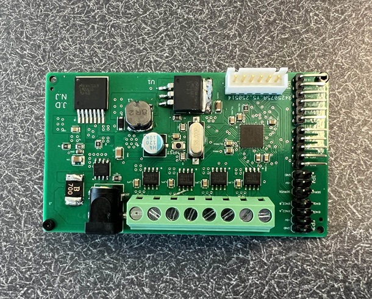
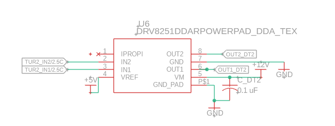
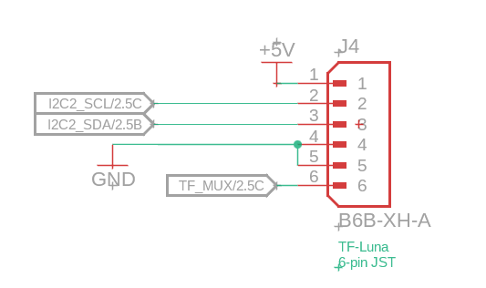
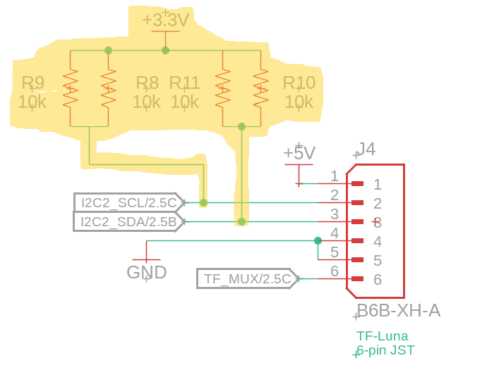

# ME 507 - Ping Pong Ball Launcher

**Team Members:** Josh DeWeese, Nolan Jeung  
**Support:** Charlie Refvem, Vincent Ngo, Jason Wong

---

## Overview

This autonomous ping pong launcher is capable of both manual and automatic targeting and launching. It rotates about two axes to aim, detects objects using a TF-Luna LIDAR, and fires ping pong balls using dual flywheels. The system is built around a custom PCB featuring an STM32 microcontroller, motor drivers, and dedicated I2C lines.

The goal of this project was to create a functional and robust autonomous targeting system while designing and assembling most of the electronics and mechanical components from scratch.

---

## 🔧 Major Hardware Components

- **2× Pololu 50:1 Gearmotors with Encoders** – control turret rotation
- **2× Maxon DCX 22 mm Motors** – power the flywheels
- **1× MG90 Servo** – feeds ping pong balls into flywheels
- **TF-Luna LIDAR Sensor** – detects range to target
- **BNO055 IMU** – reports heading (used for debug; not integrated into control loop)
- **Custom PCB** – provides regulated power, microcontroller I/O, and motor driver interfaces

---

## 📦 PCB Design and Iteration

### Fusion 360 CAD Render

### Assembled PCB - Before Hotfixes

### Assembled PCB - After Hotfixes

**This board includes:**

- STM32F411CEU6 microcontroller
- DRV8251 motor drivers
- Barrel jack for 12V input
- 5V and 3.3V rails (via Buck and LDO regulators)
- I2C, UART, and GPIO breakout headers

---

## ⚠️ Roadblocks and Debugging Challenges

### 1. **Motor Driver Output Failures**

**Issue:** Turret motor driver (DRV8251) failed to drive motors consistently.

**Cause:** Missing or insufficient bulk capacitance and improper IPROPI pin handling.  
**Fix:**

- Added 0.1 µF and 4.7 µF capacitors to stabilize power rails
- Pulled IPROPI to GND through a 1.5kΩ resistor

#### Fusion Schematic Before Fix

#### Fusion Schematic After Fix

---

### 2. **LIDAR Inconsistent I2C Behavior**

**Issue:** TF-Luna LIDAR would intermittently drop off the I2C bus.  
**Cause:** No pull-up resistors on SDA and SCL lines.  
**Fix:** Manually added 10kΩ pull-ups from both lines to 3.3V.

#### Fusion Schematic Before Fix

#### Fusion Schematic After Fix

#### Physical Pull-up Resistor Fix (3 Angles)

  
  

---

## 🧠 Software & Control Strategy

- **Main Loop FSM**: Manages launcher states (initialize, idle, move, scan, fire)
- **Manual Mode**: Accepts UART commands like `T1XX`, `M2XX`, `FIRE`, etc.
- **Auto Mode**: Scans with turret, stores LIDAR readings, picks closest target
- **IMU Mode**: Streams heading data (future FSM integration planned)

**FSM States Include:**

- `STATE_0`: Initialize
- `STATE_1`: Idle/Wait
- `STATE_2`: Move Turret
- `STATE_3`: Read LIDAR
- `STATE_4`: Spin Flywheels
- `STATE_5`: Fire via Servo
- `STATE_6`: Autonomous Scan Mode

---

## 📈 Future Work

- Use IMU feedback to correct turret drift
- Add computer vision for target recognition
- Replace UART shell with GUI or wireless input

---

## 📂 Repository Structure
